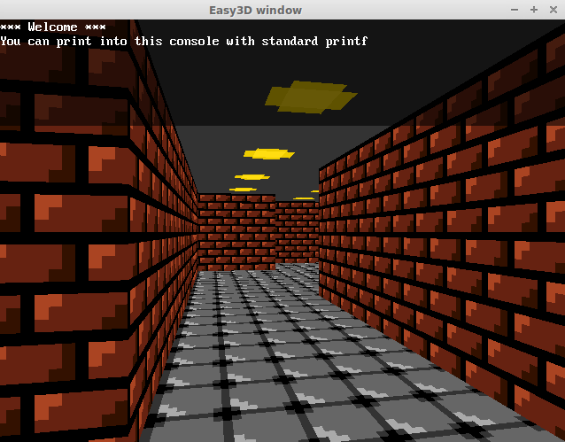

easy3d
======
2013 Mario Macías

Simple Wolfenstein-3D-like library for OpenGL that I made for my basic C programming
students (source is in Spanish language).

Ubuntu packages: build-essential libsdl2-dev

gcc test.c consola.c -lSDL2 -lGL -lGLU -lm -g
